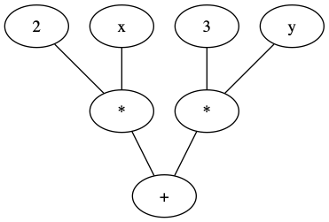

# Computational Graph interview question

## About

## Examples

Here is an example of the graph `2x + 3y`:

There are some more examples in the `csv` and `dot` directories. 

### Setup

To run the dot examples, you must first `brew install dot`

To run the python examples, you must first `pip install -r requirements.txt`

### Run

You can visualise the examples by running e.g.:

    ./dot-to-png.sh dot/coloured_graph.dot

    python plot-csv.py coloured-graph

